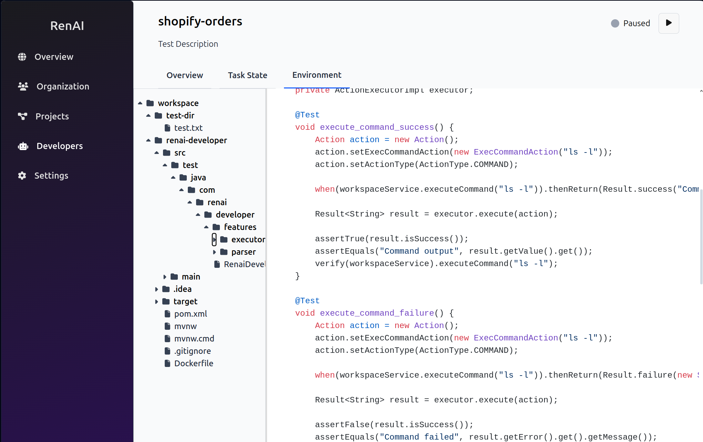

# RenAI

## 🌟 Overview

RenAI is a platform aiming to automatize development of software projects. It centers around an LLM agent that iteratively builds a codebase according to user specificatios, interacting with a dedicated environment and outside sources.

## ✨ Key Features

* **Full Stack Web Application Building**: The LLM agent develops both backend and frontend projects in a variety of modern frameworks (eg. Spring Boot, Angular).
* **App Specification**: Users can provide detailed specifications for their desired application, including technologies, coding styles and code templates, or rely on the agent to make choices.
* **Agent Lifecycle Management**: RenAI provides an intuitive interface for managing the agent's workflow and interacting with its environment.
* **Configurable Infrastructure**: Users can run the agent on common infrastructure to minimize costs or set up an isolated environment for security. 
* **Testing**: The agent regularly writes tests and runs them to ensure code quality.

## 🚀 Quick Start

RenAI is not yet in production, but you can run the code locally following these steps:

1. Ensure you have Docker, Minikube, KubeCTL, Helm and Java JDK 21. You also need a newer version of Python and at least 6GB of free RAM for the LLM model inference.
2. Fork and fetch the [RenAI backend](https://github.com/TudorOrban/RenAI-backend) repository and open a terminal in its root.
3. You need to build a Docker image for each of the core microservices: `renai-core`, `renai-developer`, `renai-gateway` and `renai-llm-inference`. For instance, for `renai-core`, you need to:
- navigate to the microservice root: `cd services/renai-core`
- Build the Java project: `mvn clean package -DskipTests`
- Build the image: `eval $(minikube docker-env)` and `docker build -t renai-core:latest .`
The `renai-llm-inference` service is a Python project so you can skip the second step.
4. Start Minikube and install Kubernetes deployments with Helm: `helm install std-release .`. Scale each service as needed by modifying the `replicaCount` in `kubernetes/dev/helm/values.yaml`.
5. To interact with the system, port-forward the API gateway, for instance `kubectl port-forward service/std-release-renai-gateway 8080:8080`. You can now make calls to `localhost:8080`
6. Fetch the [Web Frontend](https://github.com/TudorOrban/RenAI-frontend) repository and run `ng serve`. You can now access the app at `localhost:4200` and run your RenAI developer!

## Status
In mid stages of development.

## Contributing
All contributions are warmly welcomed. Head over to [CONTRIBUTING.md](https://github.com/TudorOrban/RenAI-fronten/blob/main/CONTRIBUTING.md) for details.
